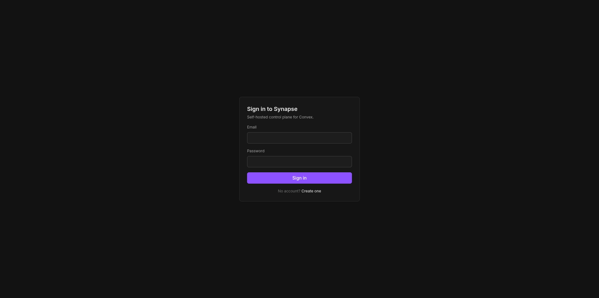
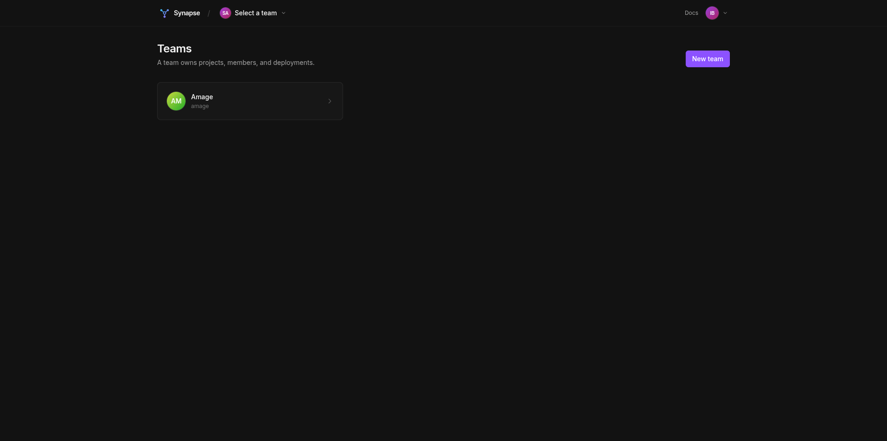
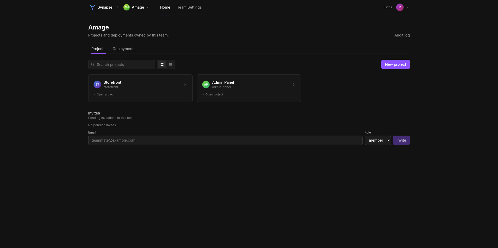
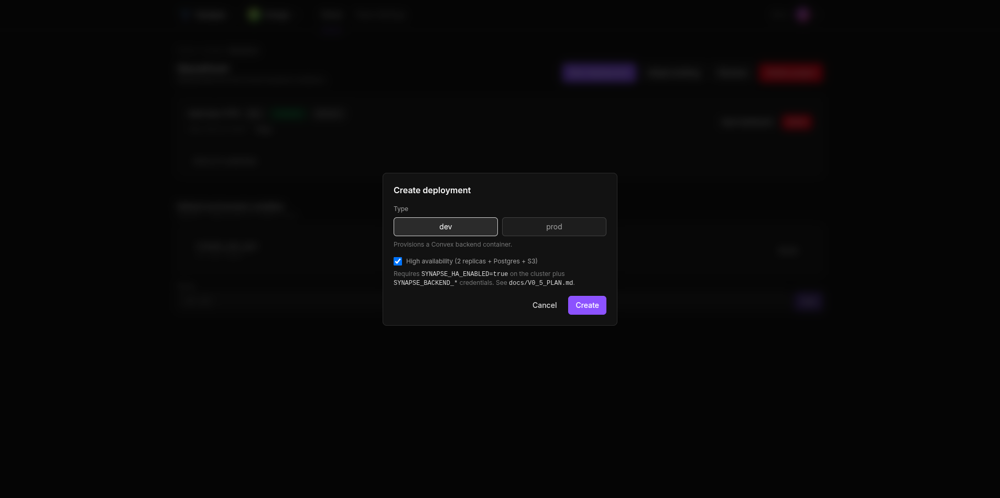
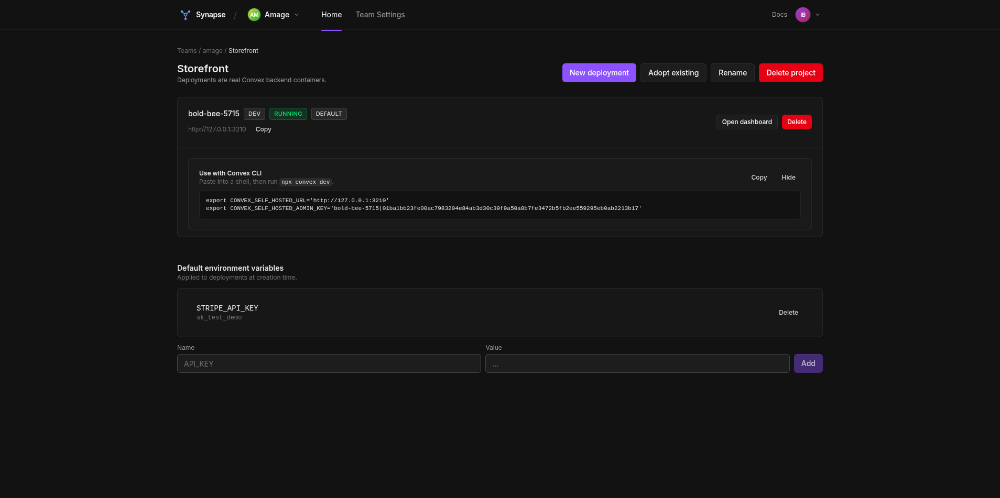
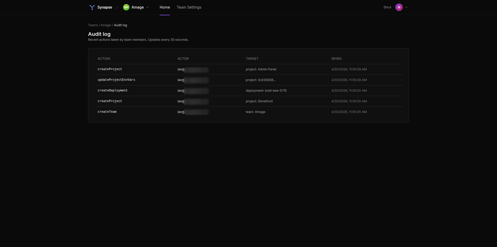
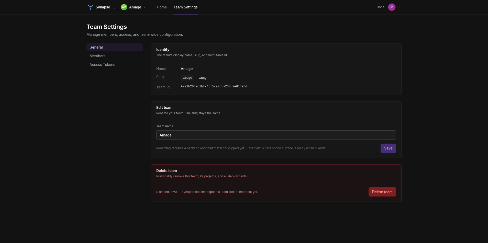
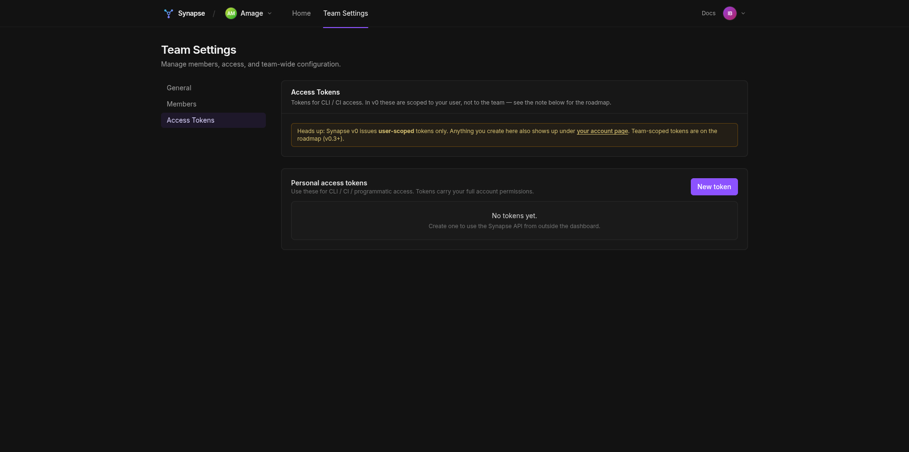
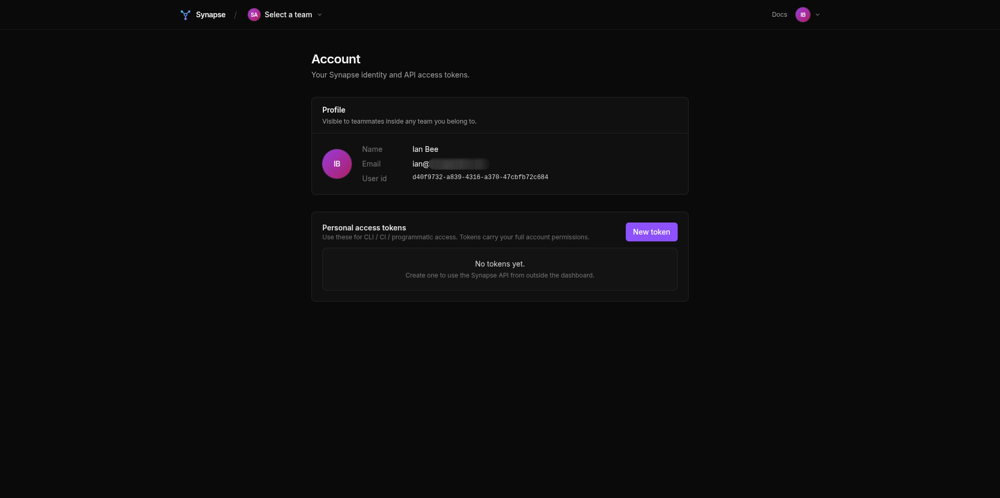

# Synapse

[](https://github.com/Iann29/convex-synapse/actions/workflows/ci.yml)
[](LICENSE)
[](https://go.dev/)
[](https://nextjs.org/)

**Open-source control plane for self-hosted [Convex](https://www.convex.dev/) deployments.**

Synapse is the missing piece for self-hosted Convex: a management layer that lets you create teams, projects, and provision multiple Convex backends from a single dashboard — replicating the experience of Convex Cloud (`dashboard.convex.dev`) on your own infrastructure.


## The problem

Convex Cloud has a slick dashboard where you log in, see all your teams, projects, and deployments, and click around to spin new ones up. The whole orchestration layer behind it is called **Big Brain** — and it's proprietary, closed-source, and only runs on Convex's infrastructure.

The official self-hosted dashboard skips that entire experience. It connects to **one** backend instance via a hardcoded URL and admin key. No teams, no projects, no provisioning. Every team/project value is a stub with `id: 0`.

Synapse fills that gap.

## Architecture

```
        ┌────────────────────────┐
        │  Dashboard (Next.js)   │  ← Convex Cloud aesthetic, talks to Synapse
        │  port 6790             │
        └──────────┬─────────────┘
                   │ REST API (OpenAPI v1 compatible)
        ┌──────────▼─────────────┐
        │  Synapse (Go)          │  ← this repo
        │  port 8080             │
        │  • Postgres (metadata) │
        │  • Docker API          │
        └──────────┬─────────────┘
                   │ provisions
       ┌───────────┼───────────┐
       ▼           ▼           ▼
   ┌───────┐  ┌───────┐  ┌───────┐
   │ BE 1  │  │ BE 2  │  │ BE N  │  ← independent Convex backends, ~1s to spin up
   │ :3210 │  │ :3211 │  │ :321N │     (or 2× replicas + Postgres + S3 in HA mode)
   └───────┘  └───────┘  └───────┘
```

## Status

**v0.5 (HA-per-deployment) feature-complete — 10/10 chunks landed.** Operators
can opt a deployment into HA at create time: 2 replicas backed by Postgres + S3,
proxy fails over between them on connection errors, health worker tracks replica
state independently, dashboard toggle + `HA ×2` badge. Single-replica behavior
is unchanged — HA is a per-deployment switch behind `SYNAPSE_HA_ENABLED`.

**Next milestone: v0.6 — Auto-installer (top priority).** Today's install
flow is "clone the repo, edit `.env`, edit Caddyfile, reload, run compose,
smoke-test from a remote shell" — too many manual steps for a project whose
whole point is making Convex self-hosting easy. The v0.6 plan replaces all
of that with one command:

```
$ curl -sf https://get.synapse.dev | sh
```

Auto-detects Docker / Caddy / nginx / port conflicts / DNS, generates
secrets, configures TLS, brings up the stack, runs a self-test, and
prints the URL + admin credentials. See
**[docs/V0_6_INSTALLER_PLAN.md](docs/V0_6_INSTALLER_PLAN.md)** for the
full phased design.

The dashboard matches the Convex Cloud aesthetic (top app bar, team picker,
redesigned home, team-settings shell), and the control plane is multi-node-safe
(v0.3). Paginated team/project listings and a migration helper for existing
self-hosted backends are also live.

## What works today

- **Auth** — register, login, refresh; JWT for the dashboard, `syn_*` opaque PATs (hashed at rest) for CLI / CI
- **Teams + invites** — multi-user via opaque invite tokens; admin/member roles
- **Projects** — CRUD, rename, delete, default env vars (set/delete batch)
- **Deployments** — real Convex backend container per deployment, ~1s provisioning
- **Adopt existing** — register an external Convex backend via `POST /v1/projects/{id}/adopt_deployment` (probes `/version` + `/api/check_admin_key` before persisting)
- **`npx convex` CLI compatibility** — signed admin keys + `cli_credentials` endpoint hands out the env-var pair the CLI expects
- **Reverse proxy** — `/d/{name}/*` routes to the right replica; multi-replica failover for HA deployments
- **Health worker** — reconciles `deployment_replicas.status` with Docker reality; rolls up to deployment status; optional auto-restart
- **Audit log** — Cloud-vocabulary actions (`createTeam`, `createProject`, `createDeployment`, `adoptDeployment`, `upgradeToHA`, …)
- **Paginated listings** — `?limit&?cursor` + `X-Next-Cursor` header on every list endpoint
- **HA-per-deployment** (opt-in) — 2 replicas + Postgres + S3, AES-GCM-encrypted creds at rest, proxy failover, dashboard toggle + `HA ×N` badge. See [docs/HA_TESTING.md](docs/HA_TESTING.md) for the operator setup.
- **Multi-node hygiene** — N Synapse processes against one Postgres + one Docker daemon: retry-on-conflict allocators, advisory-lock-coordinated periodic workers, persistent provisioning queue with `SELECT FOR UPDATE SKIP LOCKED`

**Tests:** ~131 Go integration tests + 20 Playwright e2e green in CI.

See [docs/ROADMAP.md](docs/ROADMAP.md) for what's next (v0.5.1 + v1.0), the
v0.5 design in [docs/V0_5_PLAN.md](docs/V0_5_PLAN.md), and the operator
guide in [docs/HA_TESTING.md](docs/HA_TESTING.md). What's deliberately out
of scope is documented in [docs/ARCHITECTURE.md](docs/ARCHITECTURE.md).

## Screenshots

### Sign in

The dashboard runs on port 6790, register a user with email + password.



### Teams

Multi-tenant by team: each team owns projects, members, and deployments.



### Team home — projects + deployments

Top app bar with team picker, breadcrumb, Projects / Deployments tabs, and
inline invites at the bottom.



### Project page — deployments

A real provisioned Convex backend. The row shows type / status / default
flags plus the URL, with one-click "Open dashboard" (the standalone
self-hosted Convex dashboard, opened with the deployment's admin key)
and a CLI-credentials panel below.


### Create deployment — single-replica or HA

Tick "High availability (2 replicas + Postgres + S3)" to opt into the HA
path; the hint explains the cluster envs you need set. Without HA enabled,
the request comes back with a friendly inline error.



### CLI credentials — `npx convex` works out of the box

The panel emits the exact `export` lines the Convex CLI looks for. Paste
into a shell and `npx convex dev` talks straight to the Synapse-managed
backend.



### Audit log

Every mutating action logs an event — admin-only read.



### Team Settings

Three panes — General, Members, Access Tokens. (Synapse is open-source
self-hosted; Cloud-only billing/usage/referral panes are deliberately
omitted.)




### Account

User-scoped personal access tokens for CLI / CI.



## Repo layout

| Path | Purpose |
|---|---|
| `synapse/` | Go backend — control plane (REST API + provisioner) |
| `dashboard/` | Next.js frontend — original app talking to Synapse's REST surface |
| `docs/` | Architecture, quickstart, roadmap, API ref, v0.5 plan, HA testing guide |
| `docker-compose.yml` | One-command local stack (+ optional `ha` profile for HA testing) |

## Quickstart

```bash
git clone https://github.com/Iann29/convex-synapse.git
cd convex-synapse
cp .env.example .env
echo "SYNAPSE_JWT_SECRET=$(openssl rand -hex 64)" >> .env
docker compose up -d
```

Open `http://localhost:6790`, register, create a team → project → deployment.
Synapse provisions a fresh Convex backend container in about a second.

For details (manual dev path, `curl` examples, `npx convex` integration), see
[docs/QUICKSTART.md](docs/QUICKSTART.md). For deploying to a real VPS with
TLS + a public domain, see [docs/PRODUCTION.md](docs/PRODUCTION.md). For
HA mode, see [docs/HA_TESTING.md](docs/HA_TESTING.md).

## Tests

```bash
# Go integration tests (need a postgres at localhost:5432, or set
# SYNAPSE_TEST_DB_URL). Each test gets its own isolated DB.
cd synapse && go test ./... -count=1

# Playwright end-to-end against the live compose stack
cd dashboard
npm install
npx playwright install chromium
npm run test:e2e
```

The CI pipeline runs all four jobs (Go, Next.js build, compose build, full
Playwright suite) on every push.

## License

Apache License 2.0 — see [LICENSE](LICENSE).

The dashboard component (`dashboard/`) is an original Next.js app that
talks to Synapse's REST surface; it is not a fork of any Convex code, and
also ships under Apache 2.0. (Reading the Convex Cloud dashboard
[OpenAPI spec](https://github.com/get-convex/convex-backend/blob/main/npm-packages/dashboard/dashboard-management-openapi.json)
to design a compatible API is fair use; we ship no code from that repo.)

## Why "Synapse"?

A synapse is the connection between neurons. Big Brain is the neuron —
Synapse is what wires the deployments together into something coherent.
Also, it's short.
