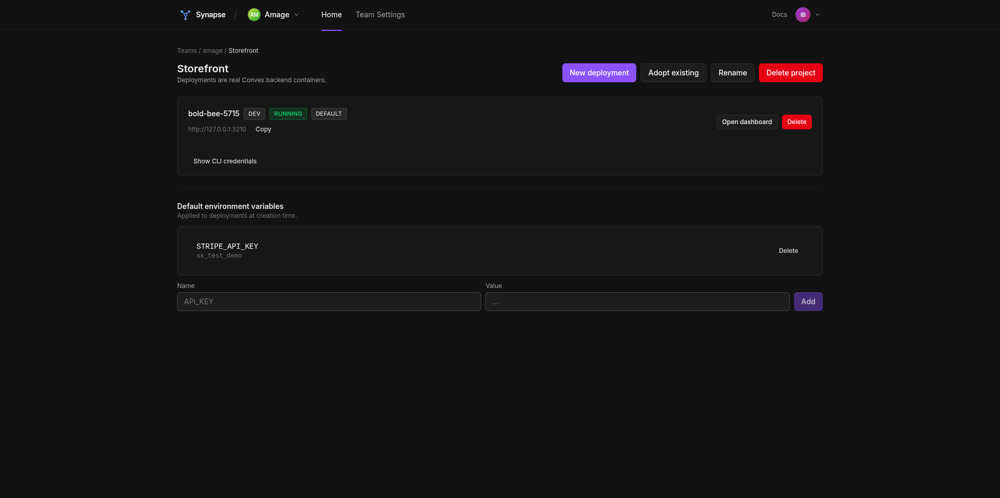

# Synapse

[](https://github.com/Iann29/convex-synapse/releases/latest)
[](https://github.com/Iann29/convex-synapse/actions/workflows/ci.yml)
[](LICENSE)
[](https://go.dev/)
[](https://nextjs.org/)

**Open-source control plane for self-hosted [Convex](https://www.convex.dev/) deployments.**

Convex's official self-hosted backend is great — but their dashboard
only talks to one instance via a hardcoded admin key. No teams, no
projects, no provisioning. Synapse is the management layer that fills
that gap: teams, projects, multi-deployment, **custom domains with
auto-TLS**, **project-level RBAC** (admin / member / viewer), S3
backups, audit log, `npx convex` auth, and an embedded Convex
Dashboard with an **in-iframe deployment picker** — all behind a
one-line installer.

**With a domain** — production setup with HTTPS:

```bash
curl -sSf https://raw.githubusercontent.com/Iann29/convex-synapse/main/setup.sh \
  | bash -s -- --domain=synapse.yourdomain.com
```

**No domain yet?** Same script, just disable TLS — works on a fresh
VPS or a laptop:

```bash
curl -sSf https://raw.githubusercontent.com/Iann29/convex-synapse/main/setup.sh \
  | bash -s -- --no-tls --skip-dns-check --non-interactive
```

Three minutes later: stack up on your VPS, admin user registered, demo
Convex deployment provisioned and self-tested. With a domain you also
get TLS via Caddy + Let's Encrypt automatically; without one, Synapse
exposes plain HTTP on `:6790` (dashboard) and `:8080` (API). Validated
end-to-end against a real Hetzner CPX22.



## Architecture

```
                  🌐 Operator's browser / npx convex
                              │ HTTPS
                              ▼
            ┌───────────────────────────────────────────┐
            │  Caddy reverse proxy                      │
            │  • Let's Encrypt for <domain>             │
            │  • on-demand TLS for *.<base-domain>      │
            │  • /v1/internal/tls_ask gates issuance    │
            └───────────────────┬───────────────────────┘
                                │
┌───────────────────────────────▼───────────────────────────────┐
│  Synapse Dashboard            Next.js • teams · projects ·    │
│                               RBAC · audit · access-tokens    │
│                               port 6790                       │
│                               • /embed/<name> shell with      │
│                                 in-iframe deployment picker   │
└──────────────┬────────────────────────────────────────────────┘
               │ REST API (OpenAPI v1 compatible)
┌──────────────▼────────────────────────────────────────────────┐
│  Synapse API                  Go • chi • pgx • docker SDK     │
│                               port 8080                       │
│                               • Postgres (metadata)           │
│                               • /d/{name}/* reverse proxy     │
│                               • <name>.<base-domain> Host     │
│                                 routing for custom domains    │
└──────────────┬────────────────────────────────────────────────┘
               │ docker run
       ┌───────┼───────┐
       ▼       ▼       ▼
   ┌───────────────────────┐    ┌───────────────────────┐
   │ Convex backend × N    │    │ Convex Dashboard      │
   │ (one container per    │    │ (data / functions /   │
   │  deployment, ~1s spin │    │  logs UI, embedded    │
   │  up; 2× replicas in   │    │  under /embed/<name>) │
   │  HA mode)             │    │                       │
   └───────────────────────┘    └───────────────────────┘
```

## What works

| Feature | Notes |
|---|---|
| Auth | email + password, JWT for the dashboard, opaque PATs for CLI / CI |
| Teams + invites | multi-user via opaque tokens, admin / member roles |
| Projects | CRUD, rename, delete, transfer between teams, slug change, default env vars (batch) |
| Project-level RBAC (v1.0+) | admin / member / viewer overrides on top of team roles — lock a contractor to read-only on one project without touching the team |
| Deployments | one Convex backend container per deployment, ~1 s provisioning |
| Custom domains (v1.0+) | `SYNAPSE_BASE_DOMAIN=<host>` → deployment URLs become `https://<name>.<host>` with Caddy on-demand TLS |
| In-iframe deployment picker (v1.0+) | green-pill switcher above the embedded Convex Dashboard, one click to swap between dev / prod / preview |
| Adopt existing | register an external Convex backend without spinning a new one |
| `npx convex` CLI | signed admin keys + `cli_credentials` panel, paste-and-go |
| Reverse proxy | `/d/{name}/*` routing with multi-replica failover for HA |
| Convex Dashboard | hosted alongside Synapse, auto-logged via postMessage handshake |
| HA-per-deployment | opt-in: 2 replicas + external Postgres + S3, AES-GCM encrypted creds |
| Scoped access tokens (v1.0+) | user / team / project / app / deployment scope; bearer enforced at every load*ForRequest |
| Audit log | Cloud-vocabulary action names, admin-only read |
| Multi-node hygiene | retry-on-conflict, advisory-lock workers, `SELECT FOR UPDATE SKIP LOCKED` queue |
| Auto-installer | `./setup.sh` or `curl \| bash` one-liner brings up the whole stack on a fresh VPS in ~3 min |
| Lifecycle commands | `--upgrade` (auto-detect via GitHub Releases, snapshot rollback), `--backup` / `--restore` (with optional S3), `--uninstall`, `--logs`, `--status` |
| First-run wizard | dashboard `/login` → `/setup` on a fresh install: admin → demo team/project/deployment in three clicks |
| Pagination | `?limit&?cursor` + `X-Next-Cursor` on every list endpoint |
| OpenAPI parity | 100% of self-hosted-relevant subset; ~60 cloud-only paths return structured `404 not_supported_in_self_hosted` |
| API stability | semver on the `/v1/...` surface; deprecation policy + change log in [`docs/API.md`](docs/API.md) |

**Tests:** 238 Go integration tests + 46 Playwright e2e + 305 bats unit
tests, all green in CI on every push.

## Releases

Latest: [**v1.0.0** — "Safe to depend on"](https://github.com/Iann29/convex-synapse/releases/tag/v1.0.0)
(2026-05-02).

`./setup.sh --upgrade` queries
[`/releases/latest`](https://github.com/Iann29/convex-synapse/releases/latest)
to discover the target tag automatically and falls back via snapshot
on failure. Versioning + deprecation policy lives in
[`docs/API.md`](docs/API.md) — semver on the `/v1/...` surface,
breaking changes bump major, error codes are stable, deprecations
get one minor cycle of dual-shipping before removal.

For roadmap, design notes, and what's deliberately out of scope, see
[`docs/ROADMAP.md`](docs/ROADMAP.md) and
[`docs/ARCHITECTURE.md`](docs/ARCHITECTURE.md). For more screenshots,
see [`docs/SCREENSHOTS.md`](docs/SCREENSHOTS.md).

## Quickstart

### Production VPS — with TLS (one-liner)

```bash
curl -sSf https://raw.githubusercontent.com/Iann29/convex-synapse/main/setup.sh \
  | bash -s -- --domain=synapse.yourdomain.com
```

DNS A-record must already point at the VPS. Caddy handles TLS via
Let's Encrypt automatically. The script clones the repo into
`/tmp/convex-synapse-bootstrap-<pid>` and re-execs itself from there
— operators see "Bootstrapping Synapse installer from ..." on stderr
before the real install starts.

### Local dev — no TLS, no domain

```bash
curl -sSf https://raw.githubusercontent.com/Iann29/convex-synapse/main/setup.sh \
  | bash -s -- --no-tls --skip-dns-check --non-interactive
```

Open `http://localhost:6790`, register, click around. Useful flags
worth knowing: `--enable-ha`, `--doctor`, `--install-dir=`,
`--upgrade [--ref=<tag>]`, `--backup [--to-s3=...]` /
`--restore=<archive|s3://...>`, `--base-domain=<host>` (for
wildcard custom-domain mode), `--no-bootstrap` (run from a local
checkout).

### Manual install (inspect first)

If you'd rather review the script before running it (good practice
for serious deploys), `git clone` and run it locally — same script,
same flags:

```bash
git clone https://github.com/Iann29/convex-synapse.git
cd convex-synapse && ./setup.sh --domain=synapse.yourdomain.com
```

For everything else (custom Caddy/nginx, HA cluster setup, the
`npx convex` flow), see
[`docs/PRODUCTION.md`](docs/PRODUCTION.md) /
[`docs/QUICKSTART.md`](docs/QUICKSTART.md) /
[`docs/HA_TESTING.md`](docs/HA_TESTING.md).

## Repo layout

| Path | Purpose |
|---|---|
| `synapse/` | Go control plane — REST API + provisioner + reverse proxy |
| `dashboard/` | Next.js dashboard talking to the REST surface |
| `setup.sh` + `installer/` | Pure-bash auto-installer + bats tests |
| `docs/` | Architecture, roadmap, production guide, design notes |
| `docker-compose.yml` | Local stack + optional `ha` / `caddy` profiles |

## Tests

```bash
# Go integration (postgres on :5432 or set SYNAPSE_TEST_DB_URL)
cd synapse && go test ./... -count=1

# Playwright e2e against the live compose stack
cd dashboard && npm ci && npx playwright install chromium && npm run test:e2e

# Bats — installer + setup.sh
docker run --rm -v "$PWD:/code" -w /code synapse-bats -r installer/test/
```

CI runs all four (Go, Next.js, compose build, Playwright) plus the
installer suite on every push.

## License

Apache License 2.0 — see [LICENSE](LICENSE).

The dashboard component is an original Next.js app talking to
Synapse's REST surface, not a fork of any Convex code. Reading the
Convex Cloud dashboard
[OpenAPI spec](https://github.com/get-convex/convex-backend/blob/main/npm-packages/dashboard/dashboard-management-openapi.json)
to design a compatible API is fair use; we ship no code from that
repo.

---

> Why "Synapse"? A synapse is the connection between neurons. Big
> Brain is the closed-source neuron Convex Cloud uses; Synapse is what
> wires self-hosted deployments together into something coherent.
> Also, it's short.
